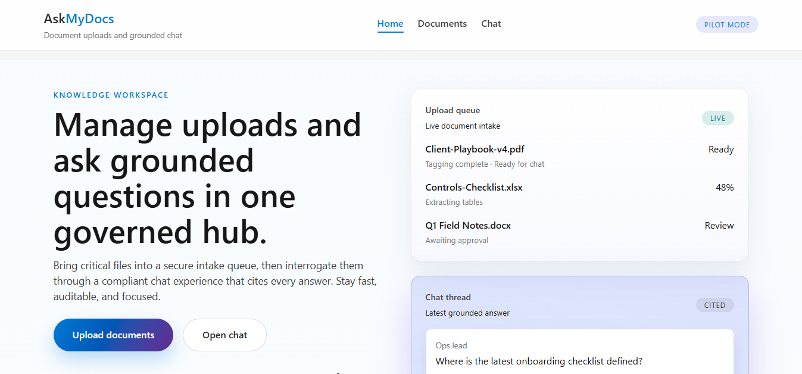
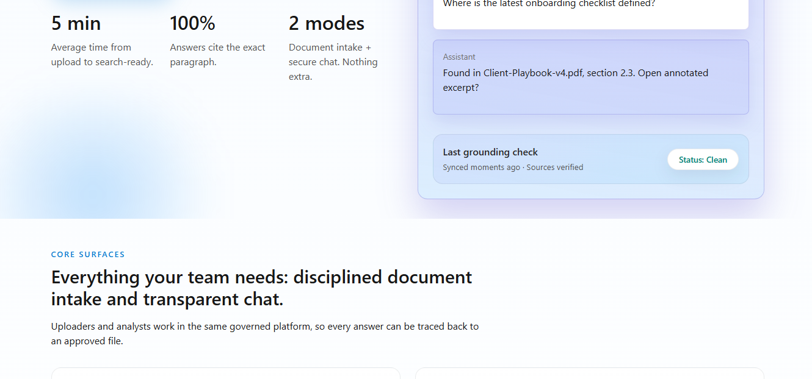
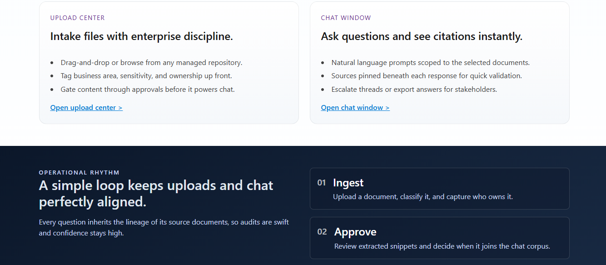
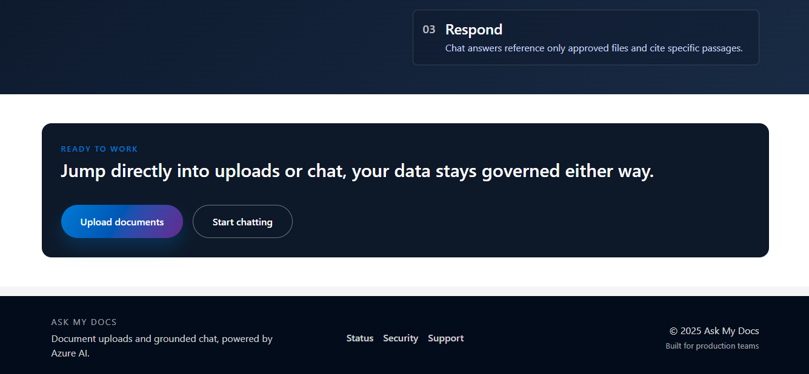
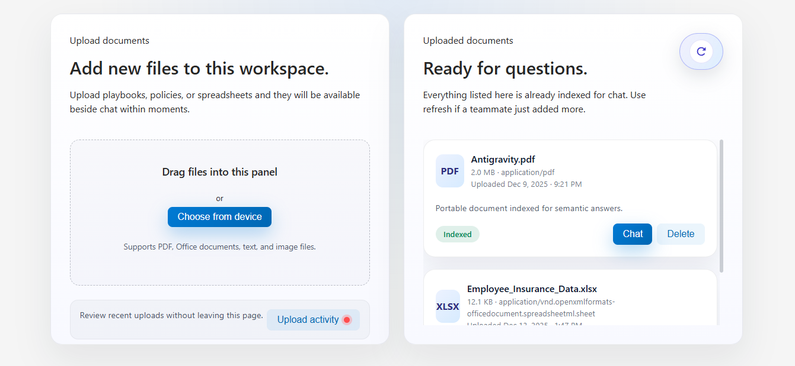
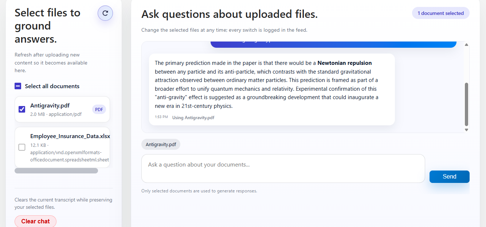
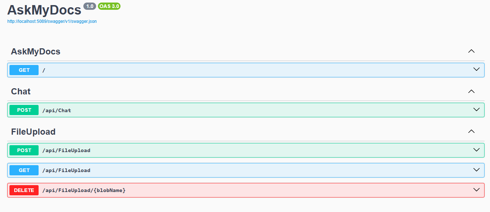

# Ask My Docs

Ask My Docs is a two-surface RAG-style workspace that lets teams upload governed documents and interrogate them through a grounded chat UI. The repository is split into a backend service that handles ingestion and retrieval, and a frontend Angular application that delivers the upload and chat experiences.

## Repository layout

```
ask-my-docs-RAG/
├─ backend/                  # ASP.NET Core service that exposes FileUpload + Chat APIs (dotnet 8)
│  └─ AskMyDocs/
│     ├─ Controllers/        # `ChatController`, `FileUploadController`
│     ├─ Services/           # Blob ingestion + chat orchestration helpers
│     ├─ Models/             # DTOs shared between controllers and services
│     ├─ appsettings.json    # Azure connection + API key placeholders
│     └─ Program.cs          # Middleware, DI, CORS, and endpoint wiring
├─ frontend/
│  └─ askmydocs/             # Angular 18 single-page application
│     ├─ src/app/
│     │  ├─ components/
│     │  │  ├─ document/     # Upload panel + indexed document grid
│     │  │  ├─ chat/         # Grounded chat experience
│     │  │  ├─ home/         # Landing page with live embeddings of both surfaces
│     │  │  └─ layout/       # Header, footer, shared styles
│     │  └─ services/
│     │     ├─ document.service.ts  # Talks to /api/FileUpload
│     │     └─ chat.service.ts      # Talks to /api/Chat
│     ├─ angular.json
│     └─ package.json
├─ docs/                     # Diagrams, screenshots, and notes
└─ README.md
```

> The backend and frontend communicate over HTTP. By default the Angular app targets `http://localhost:5089` for both the FileUpload and Chat controllers, matching the local dotnet development port.

## Key features

- **Document intake center** – drag-and-drop or manual uploads, inline progress, retry support, and toast notifications. Successfully ingested documents appear instantly in the indexed list.
- **Indexed document catalog** – shows every document that is cleared for chat, including size, MIME type, uploaded timestamp, and quick actions to launch a chat or delete the file.
- **Grounded chat** – users pick the documents that will serve as context, send natural language prompts, and receive markdown-formatted answers with provenance metadata.
- **Live home workspace** – the landing page embeds the actual upload and chat components so demos or QA can happen from a single route.

## Demo & visuals

- **Video walkthrough** – [Watch the end-to-end flow on YouTube](https://youtu.be/mVxnBx-GVSI) to see uploads, indexing, and RAG chat in action.
- **Screenshots** – key surfaces captured from the latest build:

	
	
	
	
	
	
	
	

## Backend service

The backend is an ASP.NET Core web API that exposes two logical areas:

| Endpoint | Method(s) | Description |
| --- | --- | --- |
| `/api/FileUpload` | GET | Returns the list of indexed blobs. The Angular client maps fields to `UploadedDocument`. |
| `/api/FileUpload` | POST (multipart/form-data) | Accepts a file stream, stores it (Azure Blob Storage by default), and responds with blob metadata. |
| `/api/FileUpload/{id}` | DELETE | Removes a blob so it no longer powers chat answers. |
| `/api/Chat` | POST | Accepts `{ message: string }` and returns either plain text or a structured payload that contains the answer text. |

> Run the backend with `dotnet build` + `dotnet run` (or from Visual Studio). It must listen on `http://localhost:5089` unless you update the frontend service URLs.

### Azure resources leveraged

- **Azure Blob Storage** – durable storage for uploaded documents; FileUploadController streams files into the configured container and returns blob metadata.
- **Azure AI Search** (Cognitive Search) – indexes blob content plus metadata so the chat surface can request grounded passages by document identifier.
- **Azure OpenAI** – turns the user prompt + retrieved passages into grounded answers; keys live in `appsettings.json` placeholders and route through `ChatService`.
- **Azure App Service / Azure Container Apps** (recommended) – typical hosting target for the ASP.NET Core API to keep it close to the storage and search accounts.

> If you run locally, the backend can still talk to cloud resources so long as the connection strings and API keys are present; for fully local development you can swap in Azurite (blob emulator) and a mock search layer.

### Retrieval-Augmented Generation (RAG) flow

1. **Ingestion** – uploads land in Azure Blob Storage; a background indexer or Azure Function enriches documents (chunking, metadata tagging) before pushing them into Azure AI Search.
2. **Retrieval** – when a chat prompt arrives, `ChatService` calls Azure AI Search using the selected document IDs to fetch top-k passages.
3. **Augmented prompt** – the backend combines the user prompt, document snippets, and provenance metadata into a single prompt template for Azure OpenAI.
4. **Response shaping** – Azure OpenAI returns an answer plus optional citations; the API normalizes this into the `ChatResponse` DTO consumed by the Angular client.
5. **Feedback loop** – the UI displays citation pills so users can re-open the source document, keeping the answer grounded.

## Frontend application 

- **Tech stack**: Angular 18 standalone components, RxJS, SCSS modules, Angular Router.
- **State flow**:
  - `DocumentService` handles upload/list/delete operations and normalizes backend responses.
  - `UploadPanelComponent` manages drag/drop, queueing, retries, and toast messaging.
  - `UploadedDocumentsComponent` displays indexed files and exposes quick actions.
  - `ChatComponent` tracks selected documents, posts prompts through `ChatService`, renders markdown-like formatting, and autoscrolls the feed.
- **Routing**: `/` (home), `/documents`, `/chat`, with a wildcard redirect back to home.

### Environment configuration

The API base URLs are hard-coded inside the services. To point to a different backend host, edit:

- `src/app/services/document.service.ts` → `baseUrl`
- `src/app/services/chat.service.ts` → `baseUrl`

You can alternatively introduce Angular environment files if you need per-build configuration.

### Local development

1. **Backend**
	```bash
	cd backend
	dotnet restore
	dotnet run
	```

2. **Frontend**
	```bash
	cd frontend/askmydocs
	npm install
	npm start   # serves on http://localhost:4200
	```

3. Visit `http://localhost:4200`, upload a document, select it in chat, and send a prompt. Watch the backend console for API activity.

### Production build

```bash
cd frontend/askmydocs
npm run build
```

Artifacts are emitted to `dist/askmydocs/` and can be deployed to Azure Static Web Apps, Netlify, or any static host. Remember to expose the backend API securely (Azure App Service, container, etc.) and update the frontend base URLs accordingly.

### Testing

- **Unit tests**: `npm test` uses Karma + Jasmine (headless Chrome).
- **Manual QA checklist**:
  - Upload a PDF and verify it appears in Uploaded Documents.
  - Delete a document and confirm it disappears without reloading.
  - Select multiple documents in chat and ensure the context pill updates.
  - Send a chat prompt and verify the loading indicator and auto-scroll behavior.

## Deployment notes

- Keep `/api/FileUpload` and `/api/Chat` behind authentication (Azure AD, Entra ID, or API keys) before exposing them publicly.
- For multi-environment deployments, add configuration for API base URLs (environment.ts or runtime config JSON) instead of editing services per environment.
- Blob storage containers should have soft delete enabled so accidental removals can be recovered.

## Troubleshooting

| Symptom | Likely cause | Fix |
| --- | --- | --- |
| Uploads stall at "Queued" | Backend not running or CORS blocked | Start the backend and ensure it allows `http://localhost:4200` origins. |
| Chat requests return "Received a response without text" | Backend returned unexpected shape | Inspect the backend response; ensure it includes `answer`, `message`, or `response` fields with text content. |
| Documents do not appear after uploading | File name parsing mismatch | Confirm the backend populates `name`, `sizeBytes`, `format`, and `uploadedOn` fields the frontend expects. |

## Contributing

1. Create a feature branch off `main`.
2. Run formatting/linting before committing.
3. Open a pull request describing backend and frontend changes (if both layers are touched).

## License

This codebase is provided for internal pilots and education.

## Author

**Guhan Karthick**

## Built With

❤️  Angular · ASP.NET Core · Azure
